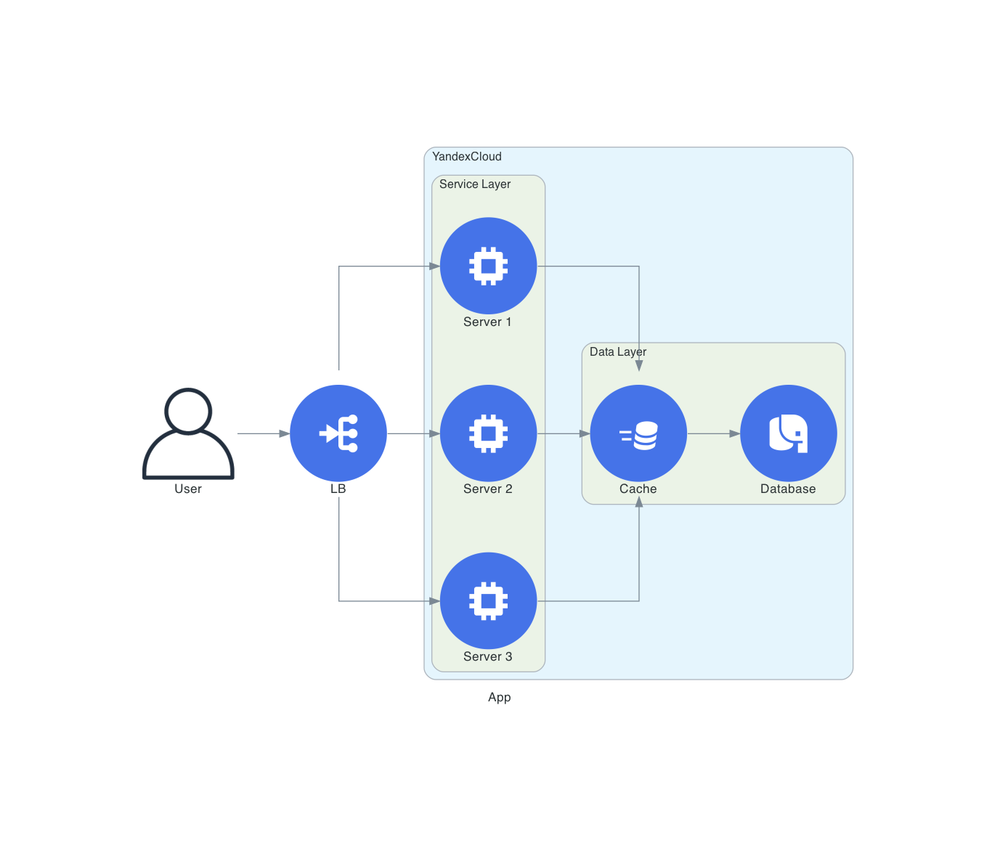

# Go-Diagrams

## Fast and easy application diagrams

Go-Diagrams is a loose port of [diagrams](https://github.com/mingrammer/diagrams).

## Contents

- [Features](#features)
- [Usage](#usage)

## Features

Turn this:

```golang
d, err := diagram.New(diagram.Filename("app"), diagram.Label("App"), diagram.Direction("LR"))
if err != nil {
    log.Fatal(err)
}

user := apps.Client.User(diagram.NodeLabel("User"))
lb := yc.Infrastructure.LoadBalancer(diagram.NodeLabel("LB"))
cache := yc.Datastorage.ManagedRedis(diagram.NodeLabel("Cache"))
db := yc.Datastorage.ManagedPostgresql(diagram.NodeLabel("Database"))

dc := diagram.NewGroup("YandexCloud").Label("YandexCloud")
dc.NewGroup("services").
    Label("Service Layer").
    Add(
        yc.Infrastructure.Compute(diagram.NodeLabel("Server 1")),
        yc.Infrastructure.Compute(diagram.NodeLabel("Server 2")),
        yc.Infrastructure.Compute(diagram.NodeLabel("Server 3")),
    ).
    ConnectAllFrom(lb.ID(), diagram.Forward()).
    ConnectAllTo(cache.ID(), diagram.Forward())

dc.NewGroup("data").Label("Data Layer").Add(cache, db).Connect(cache, db)

d.Connect(user, lb, diagram.Forward()).Group(dc)

if err := d.Render(); err != nil {
    log.Fatal(err)
}
```

Into this:



## Usage

```sh
go get github.com/blushft/go-diagrams
```

Create a diagram:

```golang
d, err := diagram.New(diagram.Name("my-diagram"), diagram.Filename("diagram")))
if err != nil {
    log.Fatal(err)
}

fw := generic.Network.Firewall().Label("fw")
sw := generic.Network.Switch().Label("sw")

d.Connect(fw, sw)
```

Render the output:

```golang
if err := e.Render(); err != nil {
    log.Fatal(err)
}
```

Go-Diagrams will create a folder in the current working directory with the graphviz DOT file and any image assets.

Create an ouput image with any graphviz compatible renderer:

```sh
dot -Tpng diagram.dot > diagram.png
```
